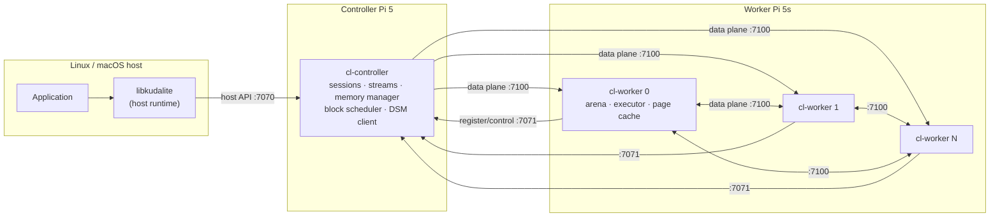
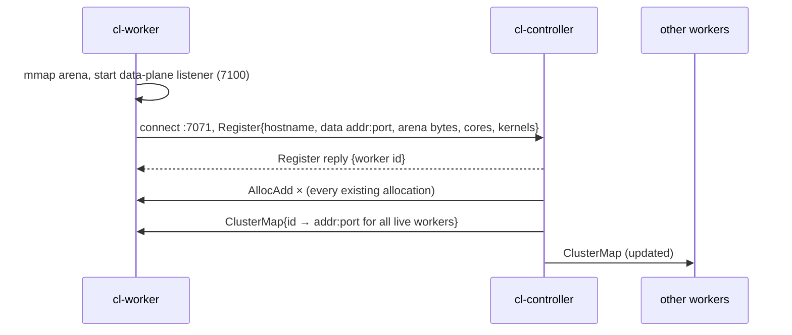
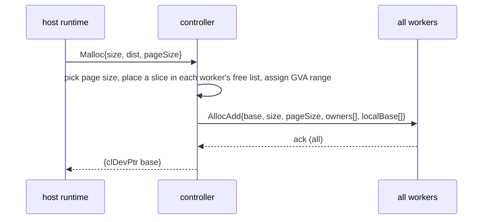
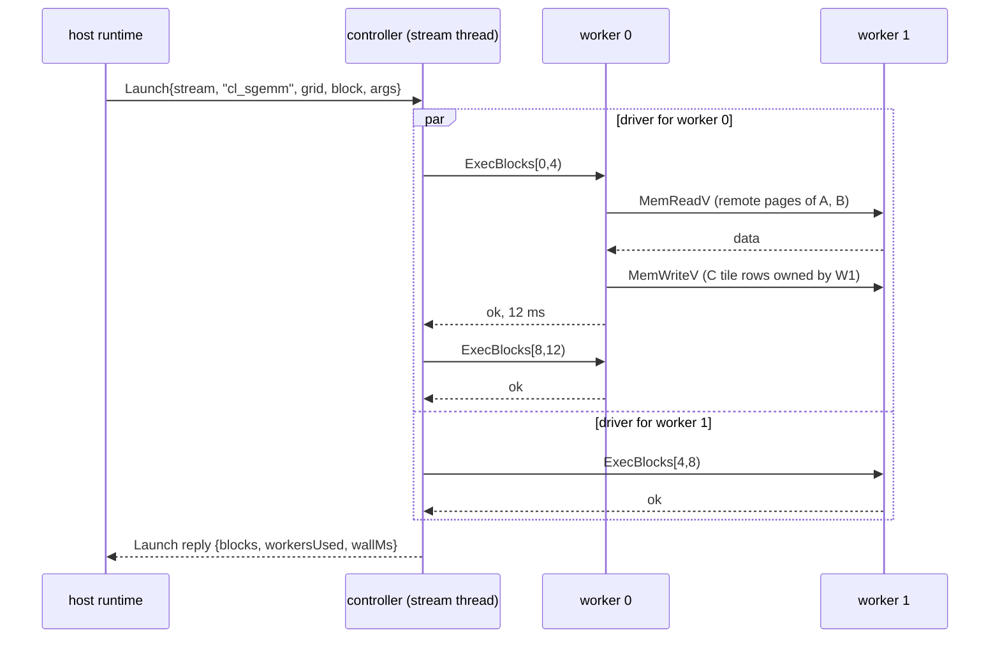

<!--
Copyright 2026 Christopher Hinds, Stratum Labs
SPDX-License-Identifier: Apache-2.0 (see the LICENSE file at the project root)
-->

# KUDA-Lite Architecture

## 1. Goals and non-goals

**Goals**

- Present a cluster of Raspberry Pi 5 boards to a Linux or macOS program as **one device**, with a programming model close enough to NVIDIA CUDA that CUDA programmers feel at home: device memory, host↔device copies, kernels over a grid of blocks, streams, and events.
- Pool the RAM of all workers into **one global address space** that any kernel on any worker can read and write.
- Keep each worker to **one operation at a time**, with the controller Pi doing all coordination.
- Be simple and portable: C++17, POSIX, no third-party dependencies, any Linux distribution.
- Make matrix multiplication (test case 1) correct and reasonably efficient.

**Non-goals for v1**

- GPU-level performance. The interconnect is 1 GbE (about 115 MB/s), not NVLink.
- Running unmodified CUDA source. Kernels are written against KUDA-Lite's block API (§5).
- Fault tolerance of global memory. If a worker is lost, the data on it is lost (§10).
- Multi-tenant security. The cluster is assumed to be on a trusted network (§11).

## 2. Terminology

| KUDA-Lite term | Meaning | NVIDIA CUDA analogue |
|---|---|---|
| **Host runtime** (`libkudalite`) | Library linked into the application on the Linux/macOS machine. The requirements call this "the kernel". | `libcudart` |
| **Controller** (`cl-controller`) | Daemon on the controller Pi. Owns scheduling, memory management and membership. | GPU driver + front end + block scheduler |
| **Worker** (`cl-worker`) | Daemon on each worker Pi. Stores part of global memory and runs blocks. | Streaming multiprocessor (SM) |
| **Global memory** | Union of all worker arenas, addressed by 64-bit `clDevPtr` | Device global memory |
| **Kernel** | Named function compiled into the worker, run once per block | `__global__` function |
| **Block** | Unit of scheduling. Runs on one worker, which uses all its cores. | Thread block |
| **Stream** | Ordered queue of operations. Different streams may overlap. | `cudaStream_t` |
| **Event** | Marker in a stream, timestamped by the controller | `cudaEvent_t` |

## 3. System overview



### Network planes and ports

| Plane | Port (default) | Direction | Carries |
|---|---|---|---|
| Host API | 7070 | host → controller | Hello, queries, malloc/free, stream ops (copies, memsets, launches, events) |
| Control | 7071 | worker → controller (connection); messages flow both ways | Register, ClusterMap, AllocAdd/AllocRemove, ExecBlocks |
| Data | 7100 | controller → worker, worker → worker | MemReadV / MemWriteV / MemFillV on arena offsets |

All three planes use the same framing and the same RPC layer ([Protocol](PROTOCOL.md)). Every connection is **full-duplex and multiplexed**: many requests may be in flight on one connection, and responses are matched by request id.

## 4. Components

### 4.1 Host runtime (`libkudalite`)

Source: [`src/host/runtime.cpp`](../src/host/runtime.cpp), [`src/host/clblas.cpp`](../src/host/clblas.cpp)

- Opens one connection to the controller (`clInit`, or implicitly on the first call) and starts a **session**. All memory the session allocates is freed automatically when the session ends, including when the process crashes.
- Tracks, for each stream, an **in-flight counter** and a **sticky error**. Every stream operation is sent as a request tagged with its stream id. The controller answers when the operation has *completed*, and the answer decrements the counter. Synchronising a stream means waiting for its counter to reach zero, then reporting and clearing the first error.
- Splits large copies into **8 MiB requests**. These pipeline through the controller, and device-to-host chunks are written straight into the caller's buffer as they arrive.
- Events keep the controller timestamp from their completion reply, so `clEventElapsedTime` measures on a single clock (the controller's).

### 4.2 Controller (`cl-controller`)

Source: [`src/controller/controller.cpp`](../src/controller/controller.cpp)

| Subsystem | Role |
|---|---|
| Membership | Accepts worker registrations, assigns ids, broadcasts the **cluster map** (id → data-plane address). Marks workers dead when their control connection drops. |
| Memory manager | Owns the global virtual address (GVA) space, plus a first-fit **free-list per worker arena**. Places each allocation's slices, then publishes the allocation record to **every** worker (and waits for acks) before returning the pointer. |
| Sessions and streams | One session per host connection. Each host stream is a `StreamQueue` (a FIFO drained by its own thread), so operations in a stream run in order and streams overlap. |
| Block scheduler | Splits a launch's grid into chunks of consecutive blocks and hands them to workers **dynamically**: each worker asks for the next chunk as soon as it finishes the previous one (§5.3). |
| Data proxy | Serves host memcpy/memset through a `DsmClient`, which reads and writes the owning workers directly, in parallel. |
| Telemetry | Samples itself, stores worker samples as they arrive, keeps a rolling history per node, and answers `GetTelemetry` ([Observability](OBSERVABILITY.md)). |

### 4.3 Worker (`cl-worker`)

Source: [`src/worker/worker.cpp`](../src/worker/worker.cpp)

| Subsystem | Role |
|---|---|
| Arena | One large anonymous `mmap` (default 60% of RAM), committed lazily by the OS. This is the worker's share of global memory. |
| Data-plane server | Serves `MemReadV`/`MemWriteV`/`MemFillV` for its arena to the controller and to peers. Handlers are bounds-checked memcpys that run on the connection's reader thread. |
| Control handler | Applies cluster-map and allocation-table updates, and queues `ExecBlocks` requests. |
| Executor | **One thread, one operation at a time.** It pops an `ExecBlocks` request, runs each block through the kernel function, and replies with status and elapsed time. |
| Thread pool | `clBlockContext::parallelFor` spreads a block's work over all cores (4 on a Pi 5). |
| DSM client + page cache | Lets kernels reach any global address. Remote pages can be cached for the duration of one launch (§ [Memory Model](MEMORY_MODEL.md#6-caching)). |
| Kernel registry | Kernels register themselves by name at static-initialisation time (`CL_KERNEL`). The list is reported to the controller on registration. |
| Telemetry | A thread samples memory, threads, CPU, temperature and executor state, and pushes it to the controller every second. |

## 5. Execution model

### 5.1 Grids and blocks

A launch names a kernel and gives `grid` and `block` dimensions (`clDim3`, as in CUDA). The grid has `grid.x·grid.y·grid.z` blocks. Each block has a linear index `b = x + gx·(y + gy·z)`.

### 5.2 Block kernels (the main deviation from CUDA)

A GPU runs thousands of lightweight threads per SM. A Pi 5 has four big cores. Emulating per-thread CUDA semantics (including `__syncthreads`) on a CPU would need fibers or compiler transforms, and would waste most of the core on scheduling overhead. So in KUDA-Lite:

- a kernel is a **function of one block**: `void kernel(clBlockContext& ctx, clArgReader& args)`;
- inside it, `ctx.parallelFor(n, body)` plays the role of the block's threads: it splits `[0, n)` over all cores and returns when all are done, which is an implicit barrier, the analogue of `__syncthreads()`;
- `ctx.scratch(bytes)` provides per-block memory, the analogue of `__shared__`;
- global memory is reached only through explicit `ctx.read*`/`ctx.write*` calls, which are batched network operations. There is no pointer dereference into global memory.

`blockDim` is passed through to the kernel unchanged, and its meaning is up to the kernel. For example, `cl_sgemm` uses it as the tile size. There is no 1024-thread limit.

### 5.3 Scheduling

```
total  = number of blocks
chunk  = max(1, total / (workers × chunkFactor))        chunkFactor = 4 by default
for each live worker w (one driver thread each, on the controller):
    loop: begin = next.fetch_add(chunk); if begin ≥ total: stop
          send ExecBlocks(kernel, grid, block, args, [begin, begin+chunk)) to w; wait for reply
```

- This is **dynamic self-scheduling**. Faster or less-loaded workers take more chunks, so a slow worker (thermal throttling, a busy network link) only delays its own last chunk.
- Chunks are **consecutive** block ranges. For row-major grids, consecutive blocks share input data (for GEMM, the same A row panel), which the worker's page cache then reuses.
- The first failing chunk sets the launch error, and the other workers stop taking new chunks. If the host session disconnects, the launch is cancelled the same way.
- **One operation per worker:** the executor thread serialises `ExecBlocks`. When two streams launch at once, their chunks interleave on the workers at chunk granularity. Neither stream starves, and no worker ever runs two operations at the same time.

### 5.4 Streams and events

- Operations in one stream run **in submission order**, and each starts only after the previous one completed. Different streams have independent `StreamQueue` threads on the controller and overlap freely.
- The **default stream (0)** is an ordinary stream. Unlike CUDA's legacy default stream, it does *not* synchronise with other streams. This is documented as a deliberate simplification.
- `clEventRecord(e, s)` queues a marker in `s`. When the marker executes, the controller stamps it with its monotonic clock. Recording increments the event's *generation*.
- `clStreamWaitEvent(s, e)` queues an operation in `s` that blocks until the generation of `e` recorded *before* the wait call has completed. This matches CUDA's capture-at-call semantics, and waiting on a never-recorded event is a no-op.
- `clFree` synchronises all of the session's streams first, as `cudaFree` does.

## 6. Key sequences

### 6.1 Cluster start-up



Workers retry the controller every 2 s, so the start order does not matter. The worker id is applied inside the response callback, before any later message on that connection is processed.

### 6.2 `clMalloc`



### 6.3 Kernel launch



### 6.4 Host → device copy

The host sends 8 MiB `MemcpyH2D` chunks. The controller's stream thread translates each chunk into page extents, groups them by owner, and sends one `MemWriteV` per owner, all concurrently. The chunk is acknowledged only when every owner has acknowledged its part.

## 7. Threading model

| Process | Threads |
|---|---|
| Host | Caller threads; one reader thread for the controller connection (it runs completion callbacks: counter updates, D2H scatter) |
| Controller | Worker accept loop; host accept loop (main thread); one reader per connection (hosts, workers, outbound data-plane connections); **one thread per host stream**; one driver thread per worker for each running launch (joined at the end); one telemetry sampler |
| Worker | Data-plane accept loop; one reader per inbound data connection; reader for the controller connection; **one executor thread**; `threads−1` pool threads; one reader per outbound peer connection; one telemetry thread |

RPC rules that keep this deadlock-free:

1. Handlers and callbacks run on the connection's reader thread and must not block on the same connection. Long work is handed off: `ExecBlocks` goes to the executor queue, stream operations go to the stream thread, and those threads reply later.
2. The data-plane handlers only memcpy, so they never wait on anything.
3. Controller locks are always taken in the order `memMu_` → `workersMu_`. Allocation and worker registration serialise on `memMu_`, so a joining worker can never miss an allocation.

ThreadSanitizer reports no data races across the full test suite, including abrupt host disconnects ([Testing](TESTING.md)).

## 8. Process lifecycle

- **Controller**: serves until killed. All state (allocations, sessions) lives in memory.
- **Worker**: if the controller connection drops, the worker exits with code 2. The data in its arena belonged to the old cluster incarnation and must not be presented as valid to a new controller. A supervisor (systemd, next phase) restarts it, and it rejoins with an empty arena.
- **Host session**: when the host disconnects (normally or by crashing), the controller cancels its running launches, stops its streams, and frees every allocation the session owned.

## 9. Configuration surface (daemons)

Every option can also be set in a config file (`--config /etc/kudalite/<role>.conf`, `key = value`), which is how the systemd services run. See [Deployment §7](DEPLOYMENT.md#7-configuration).

| `cl-controller` | Default | | `cl-worker` | Default |
|---|---|---|---|---|
| `--bind` | 0.0.0.0 | | `--controller` | 127.0.0.1:7071 |
| `--host-port` | 7070 | | `--bind` / `--data-port` | 0.0.0.0 / 7100 |
| `--worker-port` | 7071 | | `--advertise` | local address of the controller connection |
| `--page-size` | 64K | | `--mem` | 60% of RAM |
| `--chunk-factor` | 4 | | `--cache` | 15% of RAM |
| `--telemetry-ms` | 1000 | | `--threads` | all cores |
| `--telemetry-history` | 600 | | `--telemetry-ms` | 1000 |
| `--log-level` | info | | `--log-level` | info |

Host programs find the controller through `clInit("host:port")` or `$KUDALITE_CONTROLLER`, and default to `127.0.0.1:7070`. `$KUDALITE_GEMM_TILE` overrides the GEMM tile size.

## 10. Failure model

| Failure | Effect | Detection and handling |
|---|---|---|
| Host process exits or crashes | Session ends | Controller cancels running launches, drops queued ops, frees the session's allocations |
| Worker process or Pi dies | **Its slice of every allocation is lost** | Control connection drops. The worker is marked dead and removed from the cluster map. Chunks running on it fail with `clErrorWorkerLost`. Later accesses to pages it owned fail with `clErrorWorkerLost`/`clErrorNetwork`. New allocations and launches use the surviving workers only. |
| Controller dies | Whole cluster state is lost | Hosts get `clErrorNetwork`. Workers exit and are restarted by their supervisor. |
| Kernel throws or reads out of bounds | Launch fails | Worker returns `clErrorLaunchFailure` / `clErrorInvalidDevicePointer`. The controller stops scheduling the launch, and the error surfaces at the next synchronisation. |
| Malformed message | Request rejected | `clErrorProtocol` reply. A corrupt frame header closes the connection. |

Replication and checkpointing of global memory are on the [roadmap](ROADMAP.md).

## 11. Security

The v1 protocol has **no authentication and no encryption**. Anyone who can reach the ports can allocate, read and write cluster memory and launch any *compiled-in* kernel. Mitigations for v1:

- Put the Pis on an isolated switch or VLAN, and bind the controller's host port to the interface the host machine uses.
- Workers never receive code, only kernel *names*, so a network attacker cannot run arbitrary code through KUDA-Lite.

Every message is bounds-checked (frame size limit, extent bounds against the arena, truncated-payload detection). TLS with mutual authentication is on the roadmap.

## 12. Design decisions and trade-offs

| Decision | Alternatives considered | Rationale |
|---|---|---|
| Block-granular kernels with `parallelFor` | Per-thread kernels with fibers or a compiler transform | Four cores per node: a block per node and a thread per core matches the hardware. Explicit batched memory access is essential when "global memory" is behind a network. |
| Explicit `ctx.read/write` instead of page-fault DSM (`mprotect` + `SIGSEGV`) | Transparent shared virtual memory | Fault-driven DSM costs a network round trip per 4 KiB fault and is hard to make correct under multithreading. Explicit batched access moves megabytes per round trip and is portable. |
| Page striping (64 KiB default) | Contiguous per-worker blocks only | Striping spreads bandwidth for *any* access pattern and needs no layout knowledge. `clDistBlocked` is available when locality matters. |
| Translation is a pure function of a small record | Distributed page tables | Each allocation needs one `AllocAdd` broadcast. Every node can then translate addresses without further lookups. |
| Controller proxies host copies | Host writes to workers directly | One connection for the host, simple ordering semantics, and the host needs no view of the cluster. The cost is that host transfers pass through the controller's NIC (a direct path is on the roadmap). |
| Dynamic chunk self-scheduling | Static partitioning | Pis throttle when hot and networks vary. Dynamic scheduling absorbs both and costs one RPC per chunk. |
| TCP with a custom binary framing | gRPC, MPI, ZeroMQ | No dependencies (so any distribution works), full control of batching and zero-extra-copy paths, and a small auditable surface. |
| Release consistency at kernel boundaries | Coherent caches | Same guarantee as CUDA global memory between blocks. The cache needs no invalidation traffic. |
