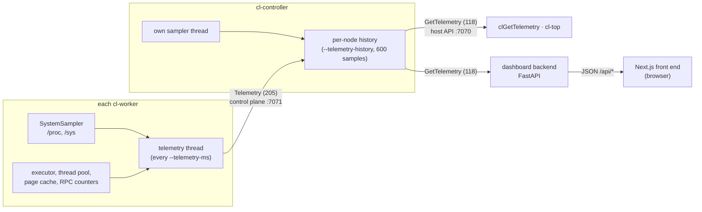

<!--
Copyright 2026 Christopher Hinds, Stratum Labs
SPDX-License-Identifier: Apache-2.0 (see the LICENSE file at the project root)
-->

# KUDA-Lite Observability

Every Pi in the cluster (each worker and the controller) measures its own health and activity once a second. The controller keeps a rolling history per node and serves it to any host. Three consumers are provided:

| Consumer | What it is | Where |
|---|---|---|
| `clGetTelemetry()` | Host API call: latest sample for every node plus cluster counters | [`kudalite.h`](../include/kudalite/kudalite.h) |
| `cl-top` | Terminal view, refreshed every second | [`tools/cl_top.cpp`](../tools/cl_top.cpp) |
| Web dashboard | FastAPI backend + Next.js front end showing all Pis live | [`dashboard/`](../dashboard/README.md) |

## 1. Data flow



- **Push from workers.** A worker's telemetry thread sends a `Telemetry` message on its existing control connection. It needs no extra port or connection, and it stops by itself if the controller goes away.
- **History at the controller.** The controller keeps the last `--telemetry-history` samples (default 600, i.e. 10 minutes at 1 s) for every node, including workers that have since disconnected, so a dead node's last moments stay visible.
- **Pull by hosts.** Any host session can send `GetTelemetry(maxHistory)`. `clGetTelemetry` and `cl-top` ask for the latest sample; the dashboard backfills the full history once, then asks for the last few samples every poll.

**Overhead.** One sample is about 170 bytes, so a 16-node cluster adds about 3 KB/s of control traffic. Sampling reads four small `/proc` and `/sys` files per second, well under 1 ms of CPU.

## 2. What is measured

All fields are per node. "Cumulative" values count up from daemon start; the dashboard turns them into rates.

| Group | Field | Meaning | Source |
|---|---|---|---|
| Time | `timestampMs` | Node wall clock (Unix ms) | `system_clock` |
| | `uptimeMs` | Daemon uptime | `steady_clock` |
| **System memory** | `memTotalBytes`, `memAvailableBytes` | Whole Pi; used = total − available | `/proc/meminfo` |
| **Process** | `rssBytes` | Resident memory of the daemon (arena pages actually touched + cache + code) | `/proc/self/status VmRSS` |
| | `processThreads` | **OS threads** in the daemon (service, reader and compute threads) | `/proc/self/status Threads` |
| **KUDA-Lite memory** | `arenaBytes` | Arena contributed to global memory | worker |
| | `arenaUsedBytes` | Allocated inside that arena | controller's free-list |
| | `cacheBytes`, `cacheCapacityBytes`, `cacheHits`, `cacheMisses` | Remote-page cache occupancy, and hits/misses (cumulative) | `PageCache` |
| **Compute threads** | `computeThreads` | **Size of the kernel thread pool** (`--threads`) | `ThreadPool::size()` |
| | `busyThreads` | Pool threads inside a kernel body at the sampling instant | `ThreadPool::busy()` |
| **CPU** | `cpuPercent` | Whole-system utilisation over the last interval | `/proc/stat` deltas |
| | `load1`, `cpuCores` | 1-minute load average, core count | `getloadavg`, `hardware_concurrency` |
| | `cpuTempC` | SoC temperature, −1 if absent | `/sys/class/thermal/thermal_zone0/temp` |
| | `cpuFreqMHz` | Current CPU clock (drops when throttling) | `/sys/devices/system/cpu/cpu0/cpufreq/scaling_cur_freq` |
| **Executor** | `executing`, `queueDepth`, `currentKernel` | Worker: running (0/1), waiting `ExecBlocks`, kernel name. Controller: `executing` = launches in progress. | worker executor |
| | `execsCompleted`, `blocksExecuted`, `execBusyNs` | Cumulative work done and time spent executing | worker executor |
| **Network** | `netRxBytes`, `netTxBytes` | All KUDA-Lite traffic of the daemon, headers included (cumulative) | `RpcPeer` counters |

Cluster-wide counters from the controller: uptime, host sessions, launches in progress and total, number and total size of allocations, total arena size.

On macOS (development hosts), the sampler fills memory total, peak RSS and load average. The Linux-only fields are left at 0 or −1 rather than guessed.

## 3. Health levels

The dashboard backend classifies each node, and the front end always shows the result as icon + label, never colour alone.

| Signal | Normal | Warning | Critical | Why |
|---|---|---|---|---|
| SoC temperature | < 70 °C | ≥ 70 °C ("Warm") | ≥ 80 °C ("Hot") | The Pi 5 firmware starts throttling at 80–85 °C, visible as a falling `cpuFreqMHz` |
| System memory used | < 80 % | ≥ 80 % | ≥ 90 % | Leave room for the page cache and the OS |
| Node status | Online | Stale (no sample for > 5 s, or backend lost the controller) | Offline (disconnected) | |

All thresholds can be changed with environment variables ([dashboard README](../dashboard/README.md#configuration)).

## 4. Wire format

### `Telemetry` (205), worker → controller

Payload: one **sample blob** (below). Response: empty. The worker does not wait for it.

### `GetTelemetry` (118), host → controller

Request: `u32 maxHistory` (≥ 1). Response:

```
u64 controllerUptimeMs, u32 sessions, u32 activeLaunches, u64 launchesTotal,
u32 allocations, u64 allocatedBytes, u64 arenaTotalBytes,
u32 nodeCount, then per node (controller first, then workers by id):
  u32 id            (0xFFFFFFFE = controller)
  u8  role          (0 worker, 1 controller)
  u8  alive
  str hostname, str address
  u64 arenaUsedBytes
  u64 lastSeenAgeMs (0xFFFFFFFFFFFFFFFF = never reported)
  u32 n, n × sample blob (oldest first)
```

### Sample blob (telemetry version 1)

A `u32` byte length followed by the body, so readers can skip fields that newer versions append:

| Offset | Type | Field | | Offset | Type | Field |
|---|---|---|---|---|---|---|
| 0 | u16 | version (1) | | 94 | u32 | cpuCores |
| 2 | u64 | timestampMs | | 98 | f32 | cpuPercent |
| 10 | u64 | uptimeMs | | 102 | f32 | load1 |
| 18 | u64 | memTotalBytes | | 106 | f32 | cpuTempC |
| 26 | u64 | memAvailableBytes | | 110 | u32 | cpuFreqMHz |
| 34 | u64 | rssBytes | | 114 | u32 | queueDepth |
| 42 | u32 | processThreads | | 118 | u32 | executing |
| 46 | u64 | arenaBytes | | 122 | u64 | execsCompleted |
| 54 | u64 | cacheBytes | | 130 | u64 | blocksExecuted |
| 62 | u64 | cacheCapacityBytes | | 138 | u64 | execBusyNs |
| 70 | u64 | cacheHits | | 146 | u64 | netRxBytes |
| 78 | u64 | cacheMisses | | 154 | u64 | netTxBytes |
| 86 | u32 | computeThreads | | 162 | str | currentKernel |
| 90 | u32 | busyThreads | | | | |

**Compatibility rule:** fields are only ever appended, and the version is bumped when they are. The C++ and Python decoders both ignore trailing bytes, and both have tests for that.

## 5. Host API

```cpp
uint32_t n = 0;
clClusterTelemetry cluster;
clGetTelemetry(&cluster, nullptr, 0, &n);            // how many nodes?
std::vector<clNodeTelemetry> nodes(n);
clGetTelemetry(&cluster, nodes.data(), n, &n);
for (auto& t : nodes)
  printf("%s: %u/%u threads busy, %.1f GiB free\n", t.hostname, t.busyThreads, t.computeThreads,
         t.memAvailableBytes / 1073741824.0);
```

`clNodeTelemetry::hasSample` is 0 until a node's first sample arrives. `lastSeenAgeMs` tells how fresh the sample is.

## 6. Configuration

| Daemon | Option | Default | Effect |
|---|---|---|---|
| `cl-worker` | `--telemetry-ms` | 1000 | Push period; 0 disables telemetry on that worker |
| `cl-controller` | `--telemetry-ms` | 1000 | Controller self-sampling period; 0 disables |
| `cl-controller` | `--telemetry-history` | 600 | Samples kept per node |

## 7. Security

Telemetry is read-only and contains no user data, but anyone who can reach the host API port can read it, including hostnames, addresses and utilisation. Keep the cluster network private, as for the rest of the v1 protocol. The dashboard backend opens an ordinary host session that never allocates memory or launches work. Expose the dashboard itself only on networks where that information may be seen (see [Roadmap](ROADMAP.md) for authentication).
